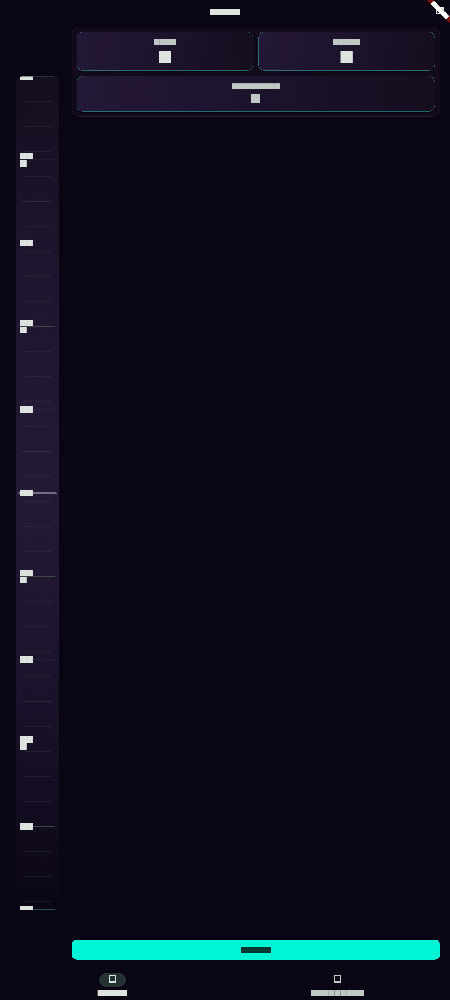
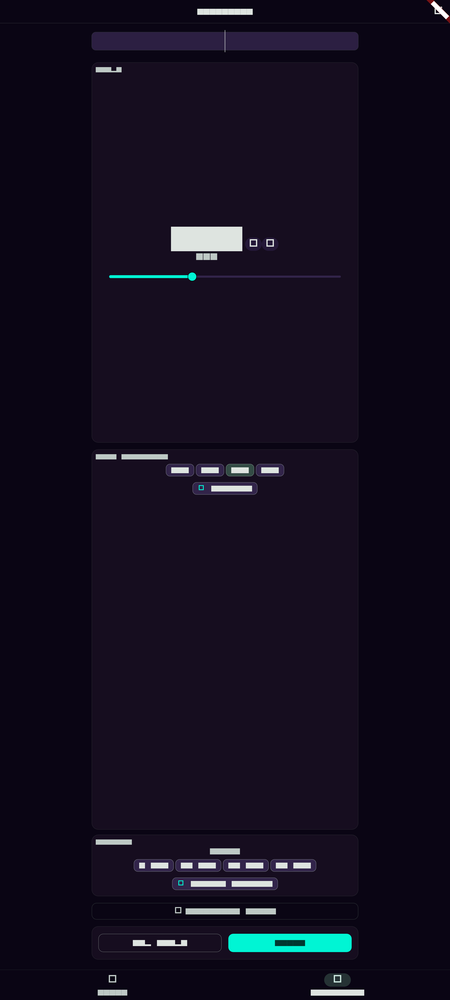
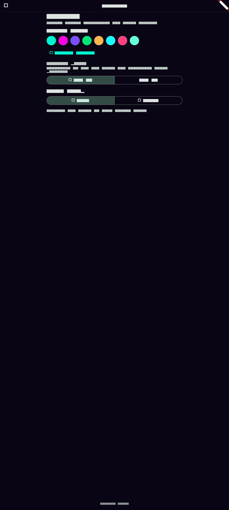

# MetroTuner

Privacy-first **metronome** and **chromatic tuner** for Android and iOS (Flutter). No analytics, no crash SDKs, and the release APK does not request network permission. The microphone is used **only** when you tap **Start** on the tuner.

| | |
|--|--|
| **Repository** | [github.com/wasaphras/MetroTuner](https://github.com/wasaphras/MetroTuner) |
| **License** | [MIT](LICENSE) |
| **Contributing** | [CONTRIBUTING.md](CONTRIBUTING.md) |

**Phones** are the primary target (Android + iOS). **Releases** ship signed **APKs** on GitHub. The **web** folder exists for experiments; it is not a supported product surface.

## Screenshots

Rendered at **1080×2400** (tall phone layout) via [`test/readme_screenshots_test.dart`](test/readme_screenshots_test.dart). Regenerate the PNGs after UI changes:

```bash
flutter test test/readme_screenshots_test.dart --update-goldens
```

Paths below are relative to the repo root so they render on GitHub.

| Tuner | Metronome | Settings |
|:---:|:---:|:---:|
|  |  |  |

**Settings** includes accent color, **concert pitch** (440 Hz or 432 Hz) for tuner and clicks, pitch strip on the left or right, and the app version line — all saved on this device only.

More assets or recordings can live under [docs/screenshots/](docs/screenshots/) (see that folder’s README).

## Features

- **Tuner:** Vertical pitch strip; place it on the **left** or **right** in Settings.
- **Theme:** **Accent color** from presets or a custom RGB value; stored on device only.
- **Metronome:** BPM, meters, tap tempo, and a **Metronome sound** screen (click pitches, waveforms, echo) from the Metronome tab. **Concert pitch** (440 vs 432 Hz) lives in **Settings → General** and applies to the tuner and metronome clicks.

## Privacy

- Release APK is built without a general internet permission — verify with `aapt` ([docs/build_and_verify.md](docs/build_and_verify.md)).
- Mic capture starts **only** after **Start** on the tuner; backgrounding the app stops it.
- No accounts, cloud sync, ads, or third-party analytics/crash SDKs.

### Reporting security or privacy issues

Please do **not** post exploitable details in a public issue first. Use GitHub **Security → Report a vulnerability** when available, or contact the maintainer privately. Ordinary bugs and feature ideas belong in [Issues](https://github.com/wasaphras/MetroTuner/issues).

### Android permission

| Permission | Why |
|------------|-----|
| `RECORD_AUDIO` | Tuner only, after you start and grant the OS prompt if asked. |

Hardening elsewhere follows the usual pattern: no cleartext traffic, tight network security config, backups off. No Firebase or similar stacks.

## Requirements

- [Flutter](https://docs.flutter.dev/get-started/install) (stable is fine)
- Android SDK and/or Xcode for device or emulator builds

The app is **portrait-only** for now.

**Arch / CachyOS:** A distro Flutter under `/usr/lib/flutter` is often root-owned and can break Gradle. Prefer a user-owned SDK, for example:

```bash
cd ~
git clone https://github.com/flutter/flutter.git -b stable --depth 1
echo 'export PATH="$HOME/flutter/bin:$PATH"' >> ~/.zshrc   # or ~/.bashrc
source ~/.zshrc
flutter doctor
```

Confirm `which flutter` points at your home copy, not `/usr/bin/...`.

## Build and run

```bash
git clone git@github.com:wasaphras/MetroTuner.git
cd MetroTuner
flutter pub get
flutter analyze
flutter test
flutter run
```

| Target | Notes |
|--------|--------|
| Android emulator | `flutter emulators --launch …` then `flutter run` |
| Physical Android | USB debugging → `flutter run` (best for mic behavior) |
| iOS | Simulator or device → `flutter run -d …` |

Further detail: [docs/testing.md](docs/testing.md).

**Shipping an APK:** [docs/build_and_verify.md](docs/build_and_verify.md). Tag `v1.2.3` matching `pubspec.yaml` so CI produces `metrotuner-v1.2.3.apk`. First-time release: use the [maintainer checklist](docs/build_and_verify.md#phase-9-maintainer-checklist) for keys and secrets.

### Coverage (core audio / pitch math)

```bash
flutter test --coverage
bash tool/verify_core_coverage.sh
```

Optional local sweep (analyze, tests, core coverage when `coverage/lcov.info` exists): `bash tool/run_code_hygiene.sh`.

Pitch, scheduler, and note math stay ≥80% on the scoped files — see [CONTRIBUTING.md](CONTRIBUTING.md).

### Sanity-check a release APK

```bash
aapt dump permissions build/app/outputs/flutter-apk/app-release.apk
```

Expect `RECORD_AUDIO`, not unexpected `INTERNET`.

```bash
apksigner verify --print-certs build/app/outputs/flutter-apk/app-release.apk
```

| | SHA-256 (signing cert) |
|--|-------------------------|
| Current published key (verify your build matches) | `501d9fbd634c4a49916087c0f3cd4c8beeb206cdeb2bfc1dddaa9380759dd8c9` |

## Icons

Sources:

- `assets/icon/app_icon.png` — 1024×1024 opaque composite (iOS + Android fallback).
- `assets/icon/app_icon_foreground.png` — transparent foreground for Android adaptive icons.
- `assets/icon/app_icon_background.png` — background layer for Android adaptive icons.
- Editable vectors: `tools/app_icon/*.svg` — re-export PNGs with `rsvg-convert -w 1024 -h 1024 <file>.svg -o assets/icon/<name>.png`, then run:

```bash
dart run flutter_launcher_icons
```

## Documentation

| Topic | Doc |
|--------|-----|
| Roadmap and notes | [plan.md](plan.md) |
| Audio and YIN pitch detection | [docs/architecture.md](docs/architecture.md) |
| Emulators and integration tests | [docs/testing.md](docs/testing.md) |
| Signing, APK, GitHub Releases | [docs/build_and_verify.md](docs/build_and_verify.md) |

## Contributing

See [CONTRIBUTING.md](CONTRIBUTING.md): be constructive, run tests, and never commit keystores or secrets.
